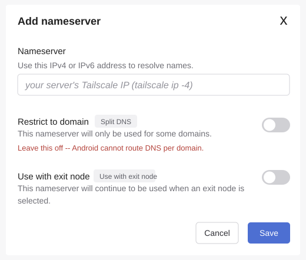

# Installation

Short path from a fresh NixOS install to this home server config.

## 1. Install NixOS

Boot the new machine from the NixOS ISO, connect wired Ethernet, and install
from the CLI.

The example below assumes the target disk is `/dev/sda` and will erase it.
Check the disk name before continuing:

```bash
sudo -i
lsblk
```

Confirm the machine was booted in UEFI mode:

```bash
ls /sys/firmware/efi
```

Partition the disk:

```bash
parted /dev/sda -- mklabel gpt
parted /dev/sda -- mkpart ESP fat32 1MiB 513MiB
parted /dev/sda -- set 1 esp on
parted /dev/sda -- mkpart root btrfs 513MiB 100%
partprobe /dev/sda
udevadm settle
lsblk
```

Format and mount the filesystems:

```bash
mkfs.fat -F 32 -n boot /dev/sda1
mkfs.btrfs -f -L nixos /dev/sda2

mount /dev/disk/by-label/nixos /mnt
mkdir -p /mnt/boot
mount -o umask=077 /dev/disk/by-label/boot /mnt/boot
```

Generate and edit the initial NixOS config:

```bash
nixos-generate-config --root /mnt
nano /mnt/etc/nixos/configuration.nix
```

Make sure the initial config includes SSH, a temporary admin user, and the UEFI
bootloader:

```nix
boot.loader.systemd-boot.enable = true;
boot.loader.efi.canTouchEfiVariables = true;

networking.networkmanager.enable = true;
services.openssh.enable = true;
networking.firewall.allowedTCPPorts = [ 22 ];

users.users.admin = {
  isNormalUser = true;
  extraGroups = [ "wheel" "networkmanager" ];
  initialPassword = "changeme";
};

security.sudo.wheelNeedsPassword = false;
```

Install and reboot:

```bash
nixos-install
reboot
```

Remove the USB key during reboot. Log in as `admin` with password `changeme`,
then change the password:

```bash
passwd
```

## 2. Bootstrap Git

The final home-server config includes Git, German keyboard layout, zsh, and Oh
My Zsh. Before the repo config is applied, use a temporary shell with Git for
the first clone:

```bash
nix-shell -p git openssl
```

## 3. Clone This Repo and Create Your Private Config

This repo is the shareable module set. Your machine is configured by a separate,
private flake that imports it.

Both checkouts can live wherever you keep your repos. The commands below write
`<home-server-checkout>` and `<your-private-config>` for the two locations —
substitute your own paths throughout. On the new machine:

```bash
# the shareable repo (for scripts and as the flake input)
git clone <this-repo-url> <home-server-checkout>

# your private config, from the template
mkdir <your-private-config> && cd <your-private-config>
cp <home-server-checkout>/example/flake.nix .
cp <home-server-checkout>/example/local.nix .
```

In `flake.nix`, point `home-server.url` at the shared repo. For a local-only
setup you can use the checkout directly:

```nix
home-server.url = "git+file://<home-server-checkout>";  # must be an absolute path
```

## 4. Generate Hardware Config

Into your **private** config:

```bash
cd <your-private-config>
sudo nixos-generate-config --show-hardware-config > hardware-configuration.nix
```

## 5. Edit Server Settings

Edit `<your-private-config>/local.nix`:

- set `server.adminSshKeys` to your SSH public key(s); SSH is enabled in
  `modules/base.nix`, but password login is disabled in the final config
- set `server.tailscaleAddress`
- adjust `server.cloudDomain`, `server.homeAssistantDomain`,
  `server.photosDomain` if not using the defaults
- keep `server.enablePublicTls = false`

This setup is intentionally private-only. Do not expose ports 80/443 through the
router and do not enable public ACME/HTTPS unless the architecture is reviewed
again.

## 6. Create Secrets

```bash
<home-server-checkout>/scripts/create-seafile-secrets.sh
```

## 7. Apply NixOS Config

This applies the home-server config, including Git, German keyboard layout, zsh,
and a default Oh My Zsh setup for the `admin` user.

```bash
sudo nixos-rebuild switch --flake <your-private-config>#family-server
```

## 8. Initialize Backups

```bash
sudo borg init --encryption=none /srv/backups/borg-local
```

## 9. Copy Home Assistant Import

If you are migrating an existing Home Assistant config, copy `.ha-import` from
the laptop to the server. Run this on the laptop from the directory containing
`.ha-import`:

```bash
scp -r .ha-import admin@<server-ip>:<home-server-checkout>/
```

Skip this step for a fresh Home Assistant setup.

## 10. Import Home Assistant

If `.ha-import/homeassistant/` is present on this machine:

```bash
./scripts/import-home-assistant-config.sh
```

## 11. Start Tailscale

```bash
sudo tailscale up
```

## 12. Configure Tailscale DNS

The server runs AdGuard Home as the DNS server for the whole tailnet. It answers
for the local service names (`cloud.home.arpa`, `ha.home.arpa`,
`photos.home.arpa` and the rest of the list under step 13) with the server's
Tailscale IP, and forwards everything else to Quad9 and Cloudflare over DNS-over-
HTTPS, applying its filter lists on the way.

Find the address to enter:

```bash
tailscale ip -4
```

In the Tailscale admin console under **DNS**, add that address as a **global**
nameserver, leave **Restrict to domain** (split DNS) switched **off**, and keep
MagicDNS enabled.



Do not configure this as a split-DNS nameserver for `home.arpa`, however much
more targeted that sounds. Android's `VpnService` API cannot route DNS per
domain: the client installs `100.100.100.100` as the tunnel's only resolver,
which answers split-DNS names itself and forwards the rest to the tailnet's
global nameservers. With no global nameserver configured it has nowhere to
forward to and cannot reliably fall back to the underlying network's resolvers,
so on a phone every public domain stops resolving while `home.arpa` keeps
working. Desktop clients implement real split DNS and hide the problem.

Making AdGuard the global resolver avoids that entirely, and the filter lists
then apply to all traffic from tailnet devices rather than just the handful of
`home.arpa` lookups.

The trade-off: DNS for connected devices now depends on this server. If it is
down, public name resolution is down too for anyone on the tailnet until
Tailscale falls back.

After this, phones and laptops connected to Tailscale can resolve the local
service names (the URLs are listed under step 13).

## 13. Check Services

```bash
systemctl status home-assistant.service
systemctl status podman-seafile.service
systemctl status immich-server.service
systemctl status adguardhome.service
```

Default local URLs:

- Home Assistant: `http://ha.home.arpa`
- Seafile: `http://cloud.home.arpa`
- Immich: `http://photos.home.arpa`

Service guides:

- [Seafile getting started](docs/seafile-getting-started.md)
- [Immich getting started](docs/immich-getting-started.md)
- [Forgejo getting started](docs/forgejo-getting-started.md)
- [Paperless-ngx getting started](docs/paperless-getting-started.md)
