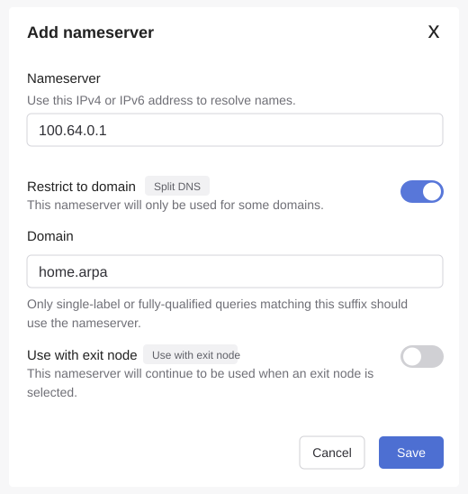

# Installation

Short path from a fresh NixOS install to this home server config.

## 1. Install NixOS

Boot the new machine from the NixOS ISO, connect wired Ethernet, and install
from the CLI.

The example below assumes the target disk is `/dev/sda` and will erase it.
Check the disk name before continuing:

```bash
sudo -i
lsblk
```

Confirm the machine was booted in UEFI mode:

```bash
ls /sys/firmware/efi
```

Partition the disk:

```bash
parted /dev/sda -- mklabel gpt
parted /dev/sda -- mkpart ESP fat32 1MiB 513MiB
parted /dev/sda -- set 1 esp on
parted /dev/sda -- mkpart root btrfs 513MiB 100%
partprobe /dev/sda
udevadm settle
lsblk
```

Format and mount the filesystems:

```bash
mkfs.fat -F 32 -n boot /dev/sda1
mkfs.btrfs -f -L nixos /dev/sda2

mount /dev/disk/by-label/nixos /mnt
mkdir -p /mnt/boot
mount -o umask=077 /dev/disk/by-label/boot /mnt/boot
```

Generate and edit the initial NixOS config:

```bash
nixos-generate-config --root /mnt
nano /mnt/etc/nixos/configuration.nix
```

Make sure the initial config includes SSH, a temporary admin user, and the UEFI
bootloader:

```nix
boot.loader.systemd-boot.enable = true;
boot.loader.efi.canTouchEfiVariables = true;

networking.networkmanager.enable = true;
services.openssh.enable = true;
networking.firewall.allowedTCPPorts = [ 22 ];

users.users.admin = {
  isNormalUser = true;
  extraGroups = [ "wheel" "networkmanager" ];
  initialPassword = "changeme";
};

security.sudo.wheelNeedsPassword = false;
```

Install and reboot:

```bash
nixos-install
reboot
```

Remove the USB key during reboot. Log in as `admin` with password `changeme`,
then change the password:

```bash
passwd
```

## 2. Bootstrap Git

The final home-server config includes Git, German keyboard layout, zsh, and Oh
My Zsh. Before the repo config is applied, use a temporary shell with Git for
the first clone:

```bash
nix-shell -p git openssl
```

## 3. Clone This Repo and Create Your Private Config

This repo is the shareable module set. Your machine is configured by a separate,
private flake that imports it. On the new machine:

```bash
# the shareable repo (for scripts and as the flake input)
git clone <this-repo-url> ~/home-server

# your private config, from the template
mkdir ~/home-server-private && cd ~/home-server-private
cp ~/home-server/example/flake.nix .
cp ~/home-server/example/local.nix .
```

In `flake.nix`, point `home-server.url` at the shared repo. For a local-only
setup you can use the checkout directly:

```nix
home-server.url = "git+file:///home/admin/home-server";
```

## 4. Generate Hardware Config

Into your **private** config:

```bash
cd ~/home-server-private
sudo nixos-generate-config --show-hardware-config > hardware-configuration.nix
```

## 5. Edit Server Settings

Edit `~/home-server-private/local.nix`:

- set `server.adminSshKeys` to your SSH public key(s); SSH is enabled in
  `modules/base.nix`, but password login is disabled in the final config
- set `server.tailscaleAddress`
- adjust `server.cloudDomain`, `server.homeAssistantDomain`,
  `server.photosDomain` if not using the defaults
- keep `server.enablePublicTls = false`

This setup is intentionally private-only. Do not expose ports 80/443 through the
router and do not enable public ACME/HTTPS unless the architecture is reviewed
again.

## 6. Create Secrets

```bash
~/home-server/scripts/create-seafile-secrets.sh
```

## 7. Apply NixOS Config

This applies the home-server config, including Git, German keyboard layout, zsh,
and a default Oh My Zsh setup for the `admin` user.

```bash
sudo nixos-rebuild switch --flake ~/home-server-private#family-server
```

## 8. Initialize Backups

```bash
sudo borg init --encryption=none /srv/backups/borg-local
```

## 9. Copy Home Assistant Import

If you are migrating an existing Home Assistant config, copy `.ha-import` from
the laptop to the server. Run this on the laptop from the directory containing
`.ha-import`:

```bash
scp -r .ha-import admin@<server-ip>:~/home-server/
```

Skip this step for a fresh Home Assistant setup.

## 10. Import Home Assistant

If `.ha-import/homeassistant/` is present on this machine:

```bash
./scripts/import-home-assistant-config.sh
```

## 11. Start Tailscale

```bash
sudo tailscale up
```

## 12. Configure Tailscale DNS

The server runs AdGuard Home as an internal DNS server on Tailscale. It resolves
the local service names to the server's Tailscale IP:

- `cloud.home.arpa`
- `ha.home.arpa`
- `photos.home.arpa`

In the Tailscale admin console, add `100.64.0.1` as a restricted/split DNS
nameserver for the `home.arpa` domain. Keep MagicDNS enabled.



After this, phones and laptops connected to Tailscale can resolve the local
service names (the URLs are listed under step 13).

## 13. Check Services

```bash
systemctl status home-assistant.service
systemctl status podman-seafile.service
systemctl status immich-server.service
systemctl status adguardhome.service
```

Default local URLs:

- Home Assistant: `http://ha.home.arpa`
- Seafile: `http://cloud.home.arpa`
- Immich: `http://photos.home.arpa`

Service guides:

- [Seafile getting started](docs/seafile-getting-started.md)
- [Immich getting started](docs/immich-getting-started.md)
